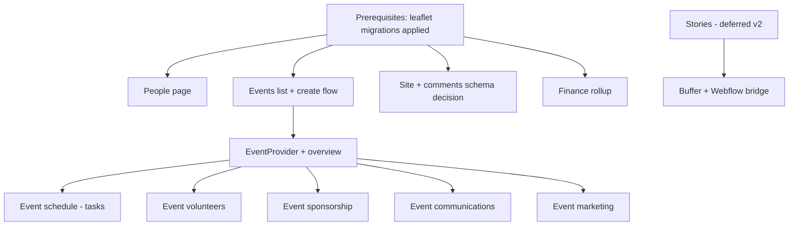

# Integrated Dashboard — Master Data Wiring Plan

> **Status:** Planning only (no implementation in this doc set)  
> **UI:** Mock/prototype pages under `/site`, `/people`, `/events-hub`, `/stories`, `/finance`, plus production leaflet pages under `/leaflet`  
> **Designs:** `integrated-dashboard.pen` (Pencil node IDs referenced per page)  
> **Database:** Supabase Postgres — schemas in `schemas/*.ts`, migrations in `supabase/migrations/`

This master plan describes how every integrated-dashboard screen should connect to the **existing** database (and known external APIs). Each page has a dedicated plan in [`pages/`](./pages/).

---

## 1. Goals

1. Replace `src/components/integrated/mockData.ts` with real queries, hooks, and API routes.
2. Reuse patterns already proven on leaflet pages (`LeafletContext`, `useDeliveries`, Stripe invoice metadata, Resend comm).
3. Migrate events off Webflow CMS incrementally — dashboard-native `events` + `event_templates` become the source of truth for `/events-hub`.
4. Keep legacy admin pages (`/neighbors/*`, `/routes/*`, `/events` CMS) working until each integrated screen is verified.

---

## 2. Architecture

### 2.1 Shell & routing

| Mode tab | Base route | Layout component | Sidebar |
|----------|------------|------------------|---------|
| Site | `/site` | `SitePageContent` | None (centered canvas) |
| People | `/people` | `PeoplePageContent` | `PeopleSidebar` |
| Events | `/events-hub` | `EventsListPageContent` | None on list; `EventSidebar` on detail |
| Leaflets | `/leaflet` | `LeafletDashboardShell` | `LeafletSidebar` + selector |
| Stories | `/stories` | `StoriesPageContent` | TBD |
| Finance | `/finance` | `FinancePageContent` | Finance nav (sidebar) |

`AdminLayoutClient` hides the legacy `AppSidebar` on all integrated routes.

> **Route note:** Integrated events live at `/events-hub` because `/events` is already used by the legacy Webflow CMS hub (`/(others-pages)/events`).

### 2.2 Recommended provider pattern

Introduce domain contexts mirroring `LeafletProvider`:

| Provider | Scope | Analog |
|----------|-------|--------|
| `PeopleProvider` | `/people` | Lightweight — mostly `usePeople` |
| `EventProvider` | `/events-hub/[eventId]/*` | `LeafletProvider` for a single event |
| `SiteProvider` | `/site/*` | Webflow site + optional comments store |

Leaflet already has `LeafletProvider` — do not duplicate.

### 2.3 Data access layers

```
UI component
  → domain hook (usePeople, useEventTasks, …)
    → Supabase client (reads/writes) OR
    → Next.js API route (Stripe, Resend, Webflow, Buffer)
```

**Prefer Supabase hooks for CRUD** on Postgres tables. **Use API routes** when secrets, Stripe, Resend, or Webflow are involved (same as leaflet comm + invoices).

### 2.4 Shared utilities to extract

| Utility | Used by | Logic |
|---------|---------|-------|
| `taskDueDate(anchorDate, offsetDays)` | Leaflet schedule, event schedule | Already in `hooks/useTasks.ts` |
| `groupTasksByDueBucket(tasks, anchorDate)` | Overview, schedule pages | Already in `leafletData.groupScheduleTasks` — generalize to accept anchor |
| `buildSponsorshipRollup(sponsorships)` | Event + leaflet sponsorship | Partially in `useLeafletSponsorships` |
| `mapStripeInvoices(rows, filter)` | Event + leaflet + finance | `LeafletContext` invoice mapper — extract |
| `personDisplayStatus(person, membership)` | People table + detail | New — map `memberships.status` |

---

## 3. Database entity map

### 3.1 Core Postgres tables (existing)

| Table | Integrated pages using it |
|-------|---------------------------|
| `people` | People, Deliverers (leaflet), Volunteers |
| `memberships` | People detail, Finance (future) |
| `payments` | People donation history, Finance |
| `businesses` | Event/leaflet sponsorships |
| `sponsorships` | Event sponsorship, leaflet sponsorship |
| `events` | Events list, all event sub-pages |
| `event_templates` | Create event, spawn tasks/comms |
| `tasks` | Event schedule, leaflet schedule |
| `task_templates` | Seed tasks on event/leaflet create |
| `comm_settings` | Event communications |
| `volunteer_asks` | Event volunteers (“hubs”) |
| `volunteers` | Event volunteer signups |
| `leaflets` | All leaflet pages |
| `deliveries` | All leaflet delivery pages |
| `routes` | Leaflet routes (via deliveries join) |
| `qr_codes` | Event overview QR, leaflet membership QR |
| `fundraising_donations` | Finance (optional rollup) |

### 3.2 External / non-Postgres sources

| Source | Pages | Existing integration |
|--------|-------|----------------------|
| **Stripe Invoices** | Event sponsorship, leaflet sponsorship, finance | `GET /api/stripe/invoices`, metadata keys in `invoiceDashboardMetadata.ts` |
| **Resend** | Event comm, leaflet comm | `comm_settings.resend_template_id`, send routes |
| **Webflow CMS** | Site canvas preview, legacy events, banners | `api/events/webflow`, `api/banners` |
| **Buffer** | Stories, event marketing | `api/buffer/posts` |
| **Resend Broadcasts** | Event marketing email list | `api/marketing/email/broadcasts` |

### 3.3 Schema gaps (plan before wiring UI)

| Gap | Affects | Recommendation |
|-----|---------|----------------|
| No `site_comments` table | Site Comments | Add `site_comments` migration **or** defer and use Webflow comment API if available |
| No `stories` / `story_posts` table | Stories | v2 — use Buffer posts + Webflow collection; see stories plan |
| No `households` table | People “All households” | Derive from `people` grouped by `address` or add `households` + `household_id` FK |
| No `birthday` on `people` | People detail panel | Add column **or** hide field until CRM supports it |
| `event_volunteers` legacy table | — | **Do not use** — prefer `volunteer_asks` + `volunteers` (already used by `/volunteers` admin) |
| `events.field_data` shape undefined | Event overview details | Document JSON schema per `event_template`; store location, capacity, image URL, description |
| Stripe `event_id` metadata is Webflow id today | Event sponsorship invoices | Migrate to Supabase `events.id` when events move off Webflow; support both during transition |

---

## 4. Page index & wiring status

| Page | Route | Plan | UI state | DB wiring |
|------|-------|------|----------|-----------|
| Site | `/site` | [site.md](./pages/site.md) | Mock canvas | ❌ |
| Site Comments | `/site/comments` | [site-comments.md](./pages/site-comments.md) | Mock comments | ❌ |
| People | `/people` | [people.md](./pages/people.md) | Mock table + detail | ❌ (`usePeople` exists) |
| Events list | `/events-hub` | [events-list.md](./pages/events-list.md) | Mock events | ⚠️ (`useEvents` partial) |
| Event overview | `/events-hub/[id]/overview` | [event-overview.md](./pages/event-overview.md) | Mock widgets | ❌ |
| Event volunteers | `/events-hub/[id]/volunteers` | [event-volunteers.md](./pages/event-volunteers.md) | Mock hubs/table | ⚠️ (`useVolunteerAsks` exists) |
| Event sponsorship | `/events-hub/[id]/sponsorship` | [event-sponsorship.md](./pages/event-sponsorship.md) | Mock sponsors/invoices | ⚠️ (patterns from leaflet) |
| Event schedule | `/events-hub/[id]/schedule` | [event-schedule.md](./pages/event-schedule.md) | Mock tasks (local state) | ⚠️ (`useTasks` leaflet-only) |
| Event communications | `/events-hub/[id]/communications` | [event-communications.md](./pages/event-communications.md) | Placeholder | ❌ |
| Event marketing | `/events-hub/[id]/marketing` | [event-marketing.md](./pages/event-marketing.md) | Placeholder | ❌ |
| Stories | `/stories` | [stories.md](./pages/stories.md) | Empty state | ❌ |
| Finance | `/finance` | [finance.md](./pages/finance.md) | Mock metrics | ❌ |
| **Leaflet overview** | `/leaflet` | [leaflet-overview.md](./pages/leaflet-overview.md) | Live | ✅ (stories card empty) |
| **Leaflet schedule** | `/leaflet/todo` | [leaflet-schedule.md](./pages/leaflet-schedule.md) | Live | ✅ |
| **Leaflet deliverers** | `/leaflet/deliverers` | [leaflet-deliverers.md](./pages/leaflet-deliverers.md) | Live | ✅ |
| **Leaflet routes** | `/leaflet/routes` | [leaflet-routes.md](./pages/leaflet-routes.md) | Live | ✅ |
| **Leaflet open routes** | `/leaflet/open-routes` | [leaflet-open-routes.md](./pages/leaflet-open-routes.md) | Live | ✅ |
| **Leaflet substitutions** | `/leaflet/substitutions` | [leaflet-substitutions.md](./pages/leaflet-substitutions.md) | Live | ✅ |
| **Leaflet sponsorships** | `/leaflet/sponsorships` | [leaflet-sponsorships.md](./pages/leaflet-sponsorships.md) | Live | ✅ |

---

## 5. Recommended implementation order

Dependencies flow top-down. Do not start lower layers until prerequisites are done.



### Phase 0 — Prerequisites (human + agent)

1. Confirm leaflet migrations `01`–`06` applied in target Supabase project.
2. Seed `event_templates` for your primary repeatable events (e.g. block party).
3. Seed `task_templates` + `comm_settings` for `context = 'event'` per template.
4. Decide `site_comments` storage (new table vs external).

### Phase 1 — People (lowest risk)

Single table + join; `usePeople` already exists. See [people.md](./pages/people.md).

### Phase 2 — Events core

1. [events-list.md](./pages/events-list.md) — expand `useEvents`, create event API.
2. [event-overview.md](./pages/event-overview.md) — `EventProvider`, `field_data` conventions.
3. [event-schedule.md](./pages/event-schedule.md) — generalize `useTasks` for `context = 'event'`.

### Phase 3 — Events satellite pages

4. [event-volunteers.md](./pages/event-volunteers.md)  
5. [event-sponsorship.md](./pages/event-sponsorship.md)  
6. [event-communications.md](./pages/event-communications.md)  
7. [event-marketing.md](./pages/event-marketing.md)

### Phase 4 — Site, Stories, Finance

8. [site.md](./pages/site.md) + [site-comments.md](./pages/site-comments.md)  
9. [finance.md](./pages/finance.md)  
10. [stories.md](./pages/stories.md) (v2)

### Phase 5 — Leaflet hardening

Verify and close gaps documented in [leaflet-*.md](./pages/) plans (mostly QA + stories card).

---

## 6. Cross-cutting API inventory

### 6.1 Existing APIs to reuse

| Endpoint | Method | Used for |
|----------|--------|----------|
| `/api/leaflets` | GET, POST | Leaflet selector (already wired) |
| `/api/leaflets/[id]/deliveries` | GET, PATCH | Routes, open routes, substitutions |
| `/api/leaflets/[id]/comm/[stepKey]/send` | POST | Deliverers comm panel |
| `/api/stripe/invoices` | GET | Sponsorship invoice tables |
| `/api/stripe/invoices/issue` | POST | Create sponsorship invoice |
| `/api/volunteers/asks` | GET, POST | Event volunteer hubs |
| `/api/volunteers/asks/[id]` | PATCH, DELETE | Hub CRUD |
| `/api/marketing/email/broadcasts` | GET | Marketing campaigns list |
| `/api/buffer/posts` | GET, POST | Social scheduled posts |
| `/api/banners` | GET, POST | Site banners (Webflow) |
| `/api/events/webflow` | GET, POST | Legacy — migrate away |

### 6.2 APIs to create

| Endpoint | Purpose |
|----------|---------|
| `GET/POST /api/events` | List + create dashboard-native events |
| `GET/PATCH /api/events/[id]` | Event detail, `field_data` updates |
| `POST /api/events/[id]/activate` | Spawn tasks from templates (mirror leaflet create) |
| `GET/PATCH /api/events/[id]/tasks` | Event schedule CRUD |
| `GET/POST /api/site/comments` | Site comments panel (if Postgres-backed) |
| `GET /api/people/[id]/payments` | Donation history for detail panel |
| `GET /api/finance/summary` | Aggregated finance metrics (optional BFF) |

---

## 7. Event vs leaflet parallelism

Many concepts are intentionally parallel. When implementing event pages, **copy leaflet patterns** rather than inventing new ones.

| Concept | Leaflet anchor | Event anchor |
|---------|----------------|--------------|
| Edition row | `leaflets` | `events` |
| Template | `task_templates` (context=leaflet) | `task_templates` (context=event, `event_template_id`) |
| Checklist instance | `tasks.context_id = leaflet.id` | `tasks.context_id = event.id` |
| Due date | `distribution_date + offset_days` | `starts_at` date + `offset_days` |
| Sponsorship scope | `sponsorships.leaflet_id` | `sponsorships.event_id` |
| Stripe invoice metadata | `leaflet_id`, `sponsorship_id` | `event_id`, `sponsorship_id` |
| Comm steps | `comm_settings` context=leaflet | `comm_settings` context=event + template |
| Volunteer grouping | N/A (deliverers = deliveries) | `volunteer_asks` per `event_id` |

---

## 8. Auth, RLS, and read-only rules

- All integrated routes sit in `(admin)` — Supabase session required (existing middleware).
- RLS on new tables should match leaflet pattern: `authenticated` full access (see `01_new_tables.sql`).
- **Read-only views:** closed leaflets (`status = 'closed'`) already enforced in `LeafletContext.readOnly`. For events, consider `field_data.status = 'completed'` or `ends_at < now()` as read-only trigger once defined.

---

## 9. Testing strategy (per page)

Each page plan ends with a verification checklist. Global smoke path after full wiring:

1. Log in → `/people` — search, select row, detail panel matches DB.
2. `/events-hub` — list loads from `events`; create new event from template.
3. Event overview — tasks, volunteers, sponsorship counts match Supabase.
4. `/leaflet` — still works unchanged (regression).
5. Stripe test mode — issue invoice from event sponsorship, appears in table.

---

## 10. Design reference (Pencil node IDs)

| Screen | Node ID |
|--------|---------|
| Site | `bi8Au` |
| Site Comments | `mhtPv` |
| People list | `PZR3p` |
| People detail selected | `B0N7uL` |
| Events list + calendar | `CpRNE` |
| Event overview | `O7GJT` |
| Event volunteers | `MgRVq` |
| Event schedule | `v399X3` |
| Event sponsorship | `p143P` |
| Leaflet overview | `M9769e` |
| Leaflet deliverers | `KslI4` |
| Leaflet routes | `j6q2x` |
| Leaflet open routes | `a1qNG3` |
| Leaflet substitutions | `vMlvE` |
| Leaflet sponsorships | `xSpNP` |

---

## 11. Related docs

- Leaflet build phases (mostly complete): [`docs/leaflet-phases/README.md`](../leaflet-phases/README.md)
- Leaflet product spec: [`docs/leaflet-dashboard-plan.md`](../leaflet-dashboard-plan.md)
- Legacy page data map: [`docs/database-pages-reference.md`](../database-pages-reference.md)

---

## 12. Next step

Start with [people.md](./pages/people.md) (fastest win), then [events-list.md](./pages/events-list.md). Track progress in the table in §4.
